<p align="center"></p>

# MeshCore Chat for Home Assistant

A sidebar chat panel and persistent message store for the [MeshCore](https://meshcore.io) mesh radio network.

Works as a **companion** to the [core meshcore integration](https://github.com/meshcore-dev/meshcore-ha) — install both. This integration does not drive the radio itself; it adds a chat UI, message persistence, and search on top of the events and services exposed by the core integration.

> **Status:** v0.1 in active development.

## Features (v0.1)

- Sidebar chat panel with channels, DMs, and contact list
- Persistent message history (survives Home Assistant restarts)
- Trace / path-discovery dialog with route visualization
- Per-conversation search
- Unread counts, delivery status
- Live device telemetry, neighbor tables, and remote command issue from the same UI
- Network-wide node discovery view (typically hundreds of nodes)

## Screenshots

### The four main tabs

<table>
<tr>
<td width="50%"><a href="docs/screenshots/chat-tab.jpg">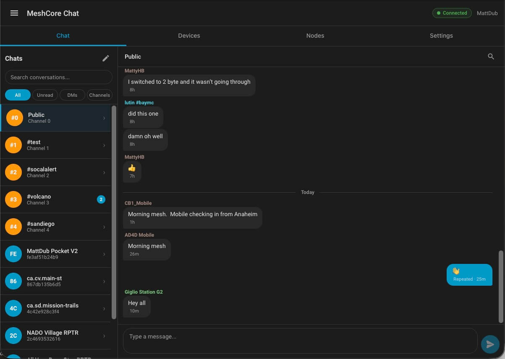</a></td>
<td width="50%"><a href="docs/screenshots/devices-tab.jpg">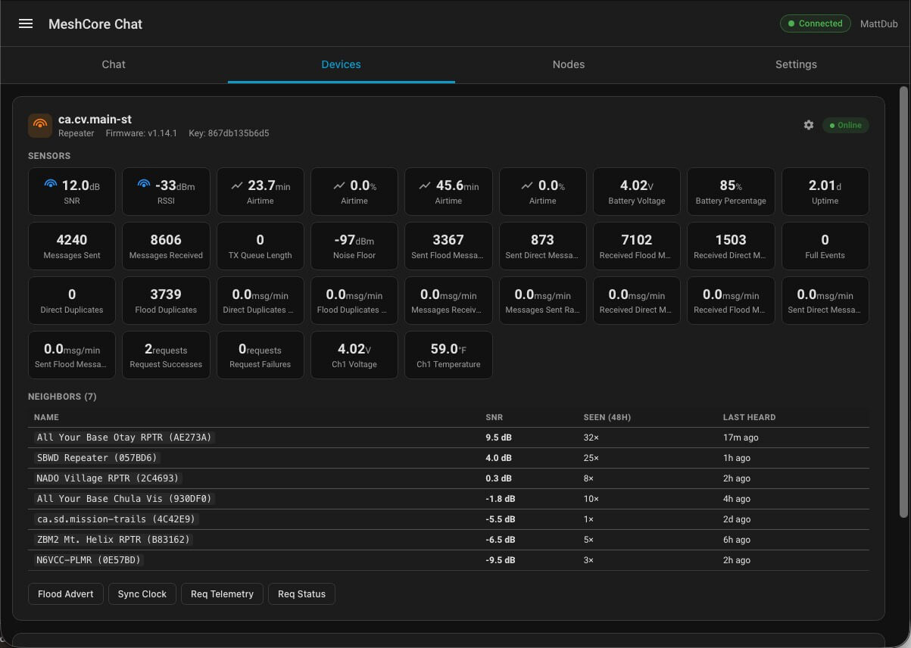</a></td>
</tr>
<tr>
<td><b>Chat</b> — channels and DMs in the left rail with All / Unread / DMs / Channels filters; messages rendered with sender, age, and delivery status (Repeated / Sent / Waiting).</td>
<td><b>Devices</b> — per-device sensor tiles (SNR, RSSI, airtime, battery, message counts) with a neighbor table and quick-action buttons (Flood Advert, Sync Clock, Req Telemetry, Req Status).</td>
</tr>
<tr>
<td><a href="docs/screenshots/nodes-tab.jpg">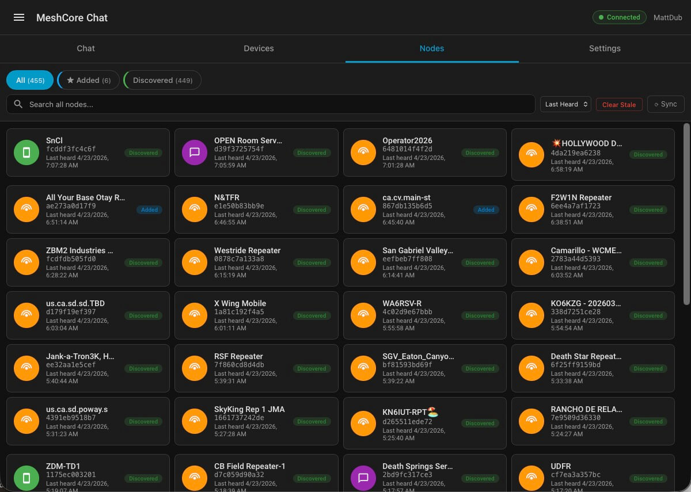</a></td>
<td><a href="docs/screenshots/settings-tab.jpg">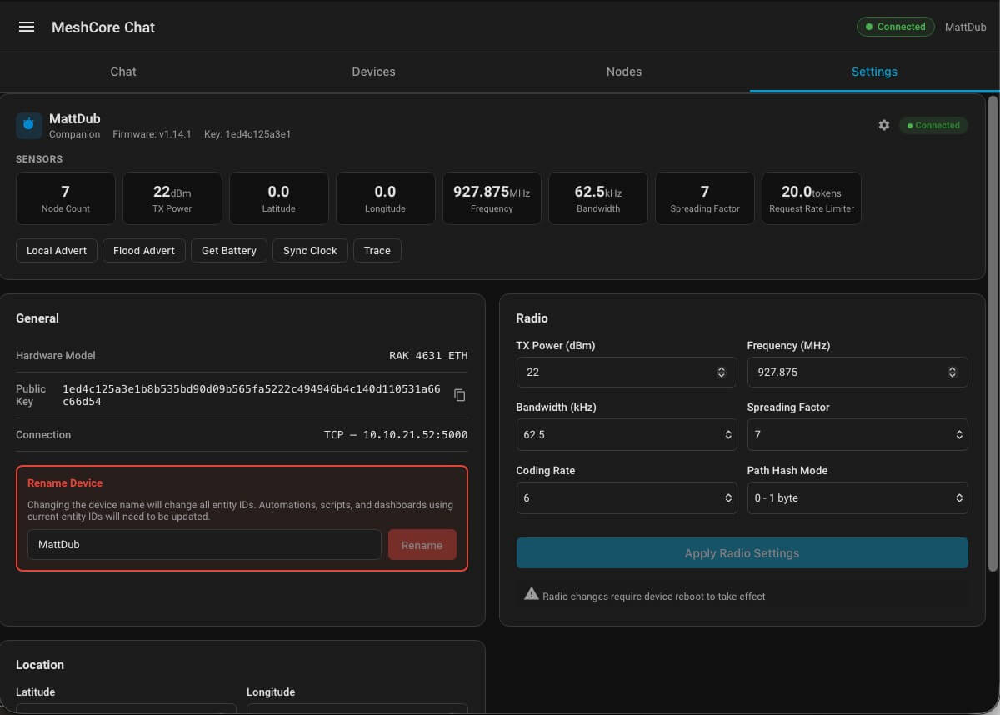</a></td>
</tr>
<tr>
<td><b>Nodes</b> — full network discovery view (All / Added / Discovered, then Clients / Repeaters), with search, last-heard sort, and stale-record cleanup.</td>
<td><b>Settings</b> — companion device profile, radio configuration (TX power, frequency, bandwidth, spreading factor, coding rate, path hash mode), rename, and location.</td>
</tr>
</table>

### Chat features

<table>
<tr>
<td width="50%"><a href="docs/screenshots/chat-popup.jpg">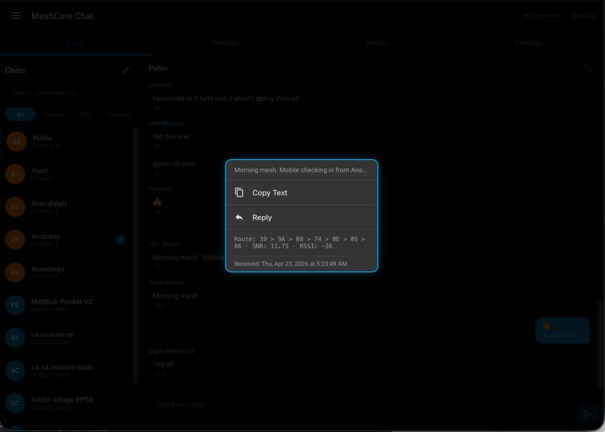</a></td>
<td width="50%"><a href="docs/screenshots/trace-dialog.jpg">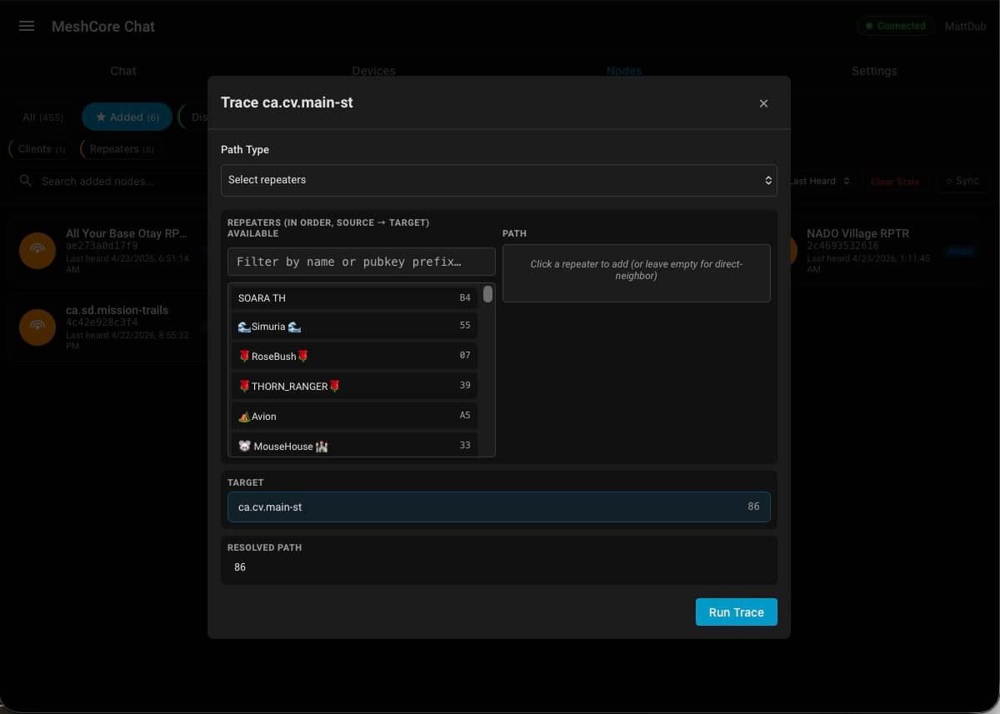</a></td>
</tr>
<tr>
<td><b>Message popup</b> — long-press any message for Copy / Reply, plus the route metadata: hop sequence, SNR, RSSI, and exact receive timestamp.</td>
<td><b>Path trace</b> — pick repeaters in order to test a multi-hop path, or run a direct-neighbor probe; resolved path is shown alongside.</td>
</tr>
<tr>
<td><a href="docs/screenshots/manage-contacts-channels.jpg">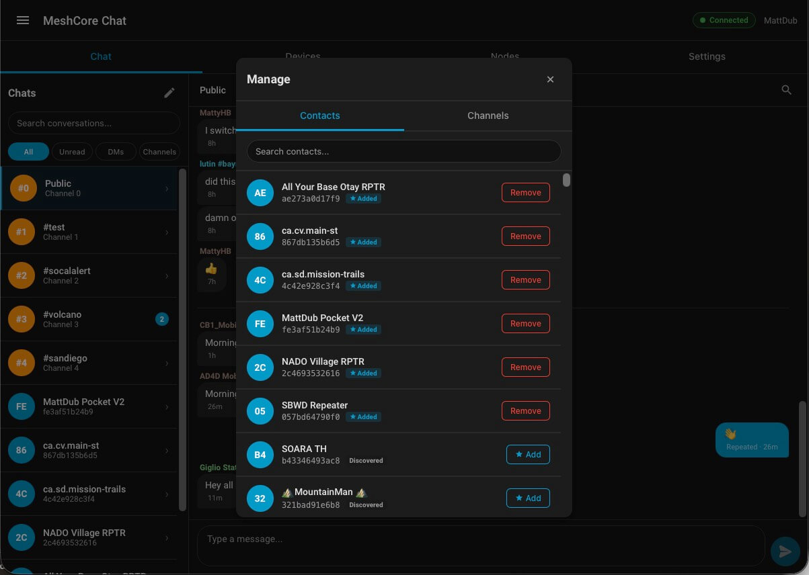</a></td>
<td><a href="docs/screenshots/node-popup.jpg">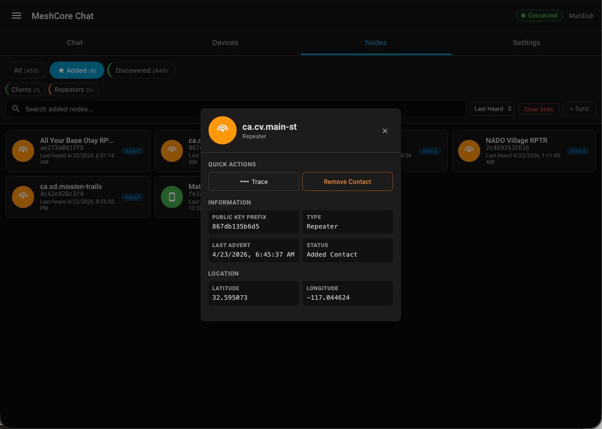</a></td>
</tr>
<tr>
<td><b>Manage contacts &amp; channels</b> — promote any discovered node to an Added contact, or remove it; channel list lives on the second tab.</td>
<td><b>Node details</b> — quick actions (Trace, Remove Contact), public-key prefix, type, last advert, and location for any discovered node.</td>
</tr>
</table>

### Device management

<table>
<tr>
<td width="50%"><a href="docs/screenshots/device-settings.jpg">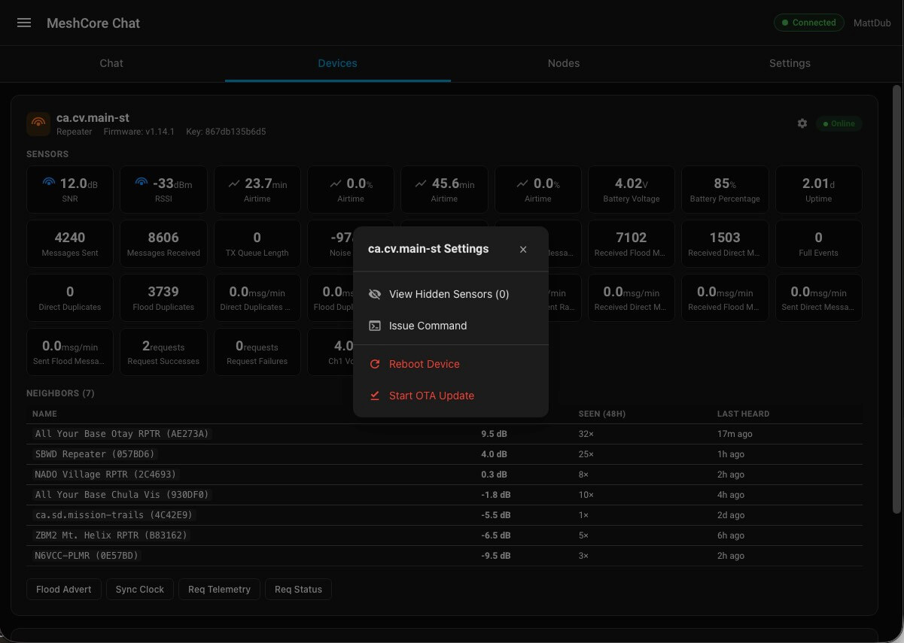</a></td>
<td width="50%"><a href="docs/screenshots/device-command.jpg">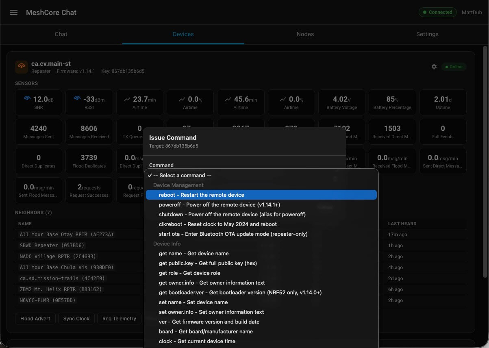</a></td>
</tr>
<tr>
<td><b>Device settings menu</b> — per-device gear menu: View Hidden Sensors, Issue Command, Reboot, Start OTA Update.</td>
<td><b>Issue Command</b> — full command catalog grouped by category (Device Management, Device Info, etc.) — drives the underlying meshcore service from the panel.</td>
</tr>
<tr>
<td><a href="docs/screenshots/companion-settings.jpg">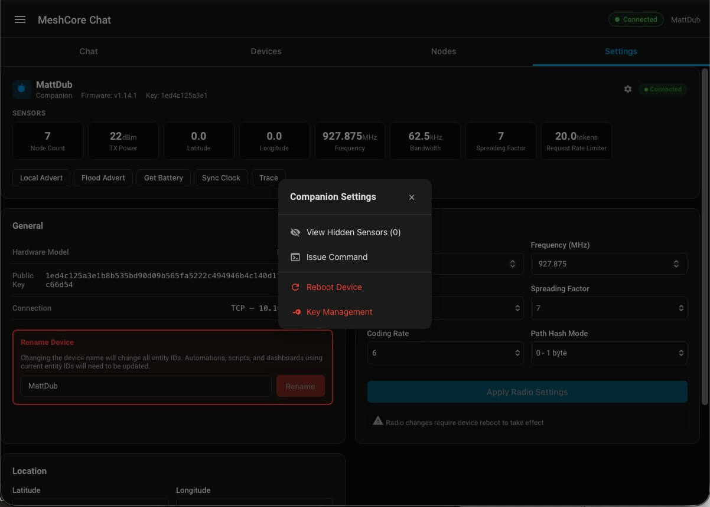</a></td>
<td><a href="docs/screenshots/tile-more-info.jpg">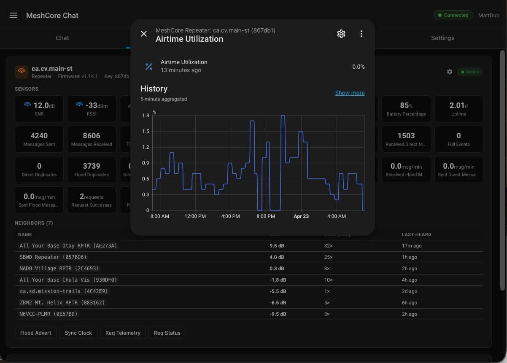</a></td>
</tr>
<tr>
<td><b>Companion settings menu</b> — same gear menu pattern for the local companion device, with Key Management as an additional option.</td>
<td><b>Sensor history</b> — clicking any sensor tile opens Home Assistant's standard more-info dialog with full historical chart.</td>
</tr>
</table>

## Installation

### HACS (custom repository)

1. In HACS → Integrations → ⋮ → Custom repositories
2. Add `https://github.com/mwolter805/meshcore-ha-chat` as an "Integration"
3. Install **MeshCore Chat**
4. Restart Home Assistant
5. Settings → Devices & Services → Add Integration → **MeshCore Chat**

### Manual

Copy `custom_components/meshcore_chat/` into your HA `config/custom_components/` directory. Restart HA. Add the integration from the UI.

## Requirements

- Home Assistant 2024.12 or newer
- The core [meshcore integration](https://github.com/meshcore-dev/meshcore-ha) installed and configured

## Relationship to other projects

- [meshcore-dev/meshcore-ha](https://github.com/meshcore-dev/meshcore-ha) — the core integration that drives the MeshCore radio. **Required.**
- [Ratty7198/MeshCore-HA-UI](https://github.com/Ratty7198/MeshCore-HA-UI) — an alternative companion UI. Great work; this project differs by using a typed/compiled Lit frontend and adding per-conversation persistence, search, and a trace dialog. The two projects use distinct domains, panel URLs, and webcomponent tags so they can coexist on the same HA instance, but installing both produces two sidebar entries — pick one.

## Development

The frontend is TypeScript built via Rollup. To rebuild after editing source:

```
cd custom_components/meshcore_chat/frontend
npm install
npm run build
```

The committed `custom_components/meshcore_chat/ha_frontend/panel.js` is what HACS ships — rebuild and commit when source changes.

## License

MIT — see [LICENSE](LICENSE).
